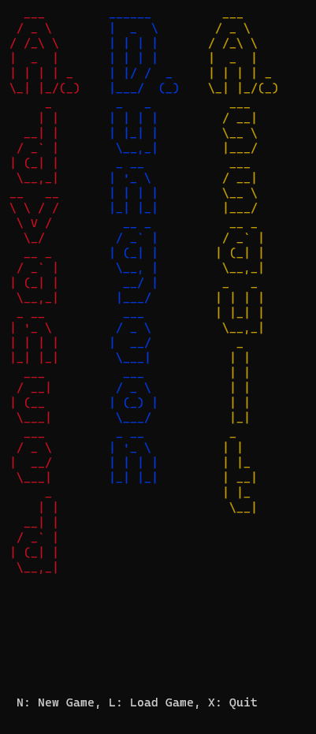

# Advanced-Dungeon-Assault
ADA Game from College

## Running using Docker
1. Run `docker build -t ada:latest .` to build the docker image and compile the code.
1. Run `docker run --rm -it ada:latest ./advgame` to enter the docker image and run the game.

## Sprite Maker
1. Run `docker build -t ada:latest .` to build the docker image and compile the code.
1. Run `docker run --rm -it ada ./spritemaker` to enter the docker image and run the editor.

