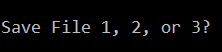

# Advanced-Dungeon-Assault
Advanced Dungeon Assault (ADA) is a pseudo-roguelike role-playing video game programmed in none other than [Ada](https://www.adacore.com/).
It was an early college project. Even though it is rough around the edges, we sincerely hope you enjoy it even a fraction as much as we loved making it.

## Features
* Dungeon exploration has never been better! ADA offers a pseudo-random map generator that includes a colored user interface and map key. Search through each level of the dungeon while clearing the fog of war, finding treasure chests and angel statues, and hunting down the final boss.

* Fight countless foes as you make your descent into the unknown! Each monster is randomly encountered and ready for battle. Make sure to prioritize the hard-hitting baddies and utilize your entire arsenal of attacks.

* Give me the loot! With an inventory system and dozens of armors, weapons, and consumables at your disposal; you will never grow weary on your quest.

* Get ready! With 4 levels comes 4 unique boss fights! Think you're strong enough to fight these powerful creatures?

* Worn out? Feel free to come back another time! ADA is capable of storing 3 different save files.

## Development
### Prerequisites
* [Docker](https://www.docker.com/) if you wish to use the existing [Dockerfile](./Dockerfile).
* [Gnat](https://www.adacore.com/download/more) if you will be executing locally.

### Running using Docker
1. Run `docker build -t ada:latest .` to build the docker image and compile the code.
1. Run `docker run --rm -it ada:latest ./advgame` to enter the docker image and run the game.

### Sprite Maker

1. Run `docker build -t ada:latest .` to build the docker image and compile the code.
1. Run `docker run --rm -it ada ./spritemaker` to enter the docker image and run the editor.

### Distribution
#### Windows
Run `mkdir dist & for %f in (Sprites,Enemies,Maps,Saves) do xcopy %f dist\%f\ /e /y & for %f in (items.dat,LICENSE,advgame.exe) do xcopy %f dist\ /y & tar.exe -a -c -f Advanced-Dungeon-Assault.zip dist` to generate the Windows release canidate.

#### Linux
Run `mkdir -p dist && cp {sprites,items.dat,LICENSE,Enemies,Maps,advgame,Saves} dist -r && tar -czvf Advanced-Dungeon-Assault.tar.gz dist` to generate the Linux release candidate.
